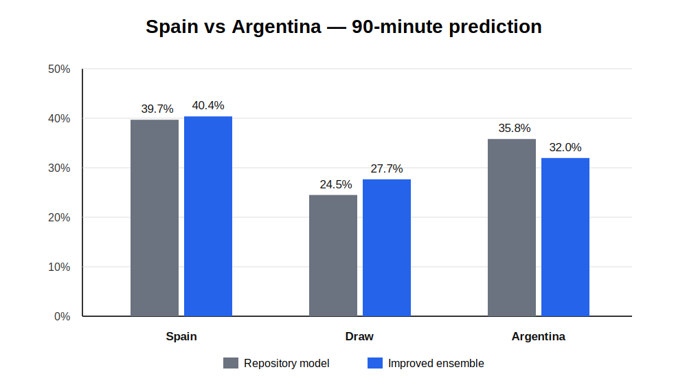

# World World Cup Predictor

A reproducible international-football match predictor built for the Spain vs Argentina 2026 World Cup final and reusable for other national-team matchups.

The model combines:

- dynamic Elo ratings;
- leakage-safe rolling form, goals and defensive features;
- recency-weighted XGBoost outcome probabilities;
- Poisson expected-goal models with a Dixon–Coles low-score correction;
- temporal validation, ensemble blending and temperature calibration;
- symmetric neutral-venue prediction.

## Spain vs Argentina result

The included run produced the following 90-minute probabilities:

| Outcome | Probability |
|---|---:|
| Spain win | 40.4% |
| Draw | 27.7% |
| Argentina win | 32.0% |

Expected goals were **Spain 1.42** and **Argentina 1.18**. The highest-probability individual scoreline was **1–1**, while Spain had the larger combined probability across all winning scorelines.



## Installation

```bash
python -m venv .venv
source .venv/bin/activate  # Windows: .venv\\Scripts\\activate
pip install -r requirements.txt
```

## Run

```bash
python improved_world_cup_predictor.py Spain Argentina --date 2026-07-19
```

The first run downloads the public `martj42/international_results` historical-results dataset into `data_cache/results.csv`. Predictions are written to `predictions/<date>/` by default.

You can also supply a local dataset and output path:

```bash
python improved_world_cup_predictor.py Spain Argentina \
  --data data_cache/results.csv \
  --output predictions/spain_argentina.json
```

## Method and limitations

Training, validation and test sets are split chronologically. Rolling features are calculated only from matches completed before each observation. This reduces future-data leakage, but the model still does not directly include confirmed lineups, injuries, tactical changes, betting-market information or verified player-level expected-goal data.

A single football match remains highly uncertain. Evaluate the model using log loss, Brier score and calibration across many matches rather than judging it from one final.

## Files

- `improved_world_cup_predictor.py` — reusable predictor.
- `spain_argentina_prediction.json` — complete model output and validation metrics.
- `spain_argentina_model_comparison.svg` — comparison with the source repository model.
- `SPAIN_ARGENTINA_MODEL_NOTES.md` — concise implementation and run notes.

## Attribution

This project was developed from ideas and code structure in Mariana Antaya's MIT-licensed `mar-antaya/world_cup_predictions` repository. Historical international results are provided by `martj42/international_results`.

## License

MIT. See `LICENSE` and `NOTICE`.
